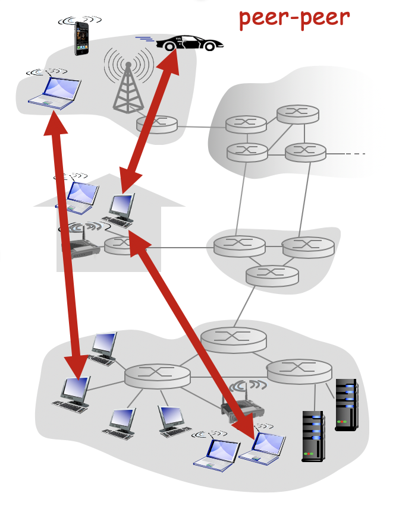
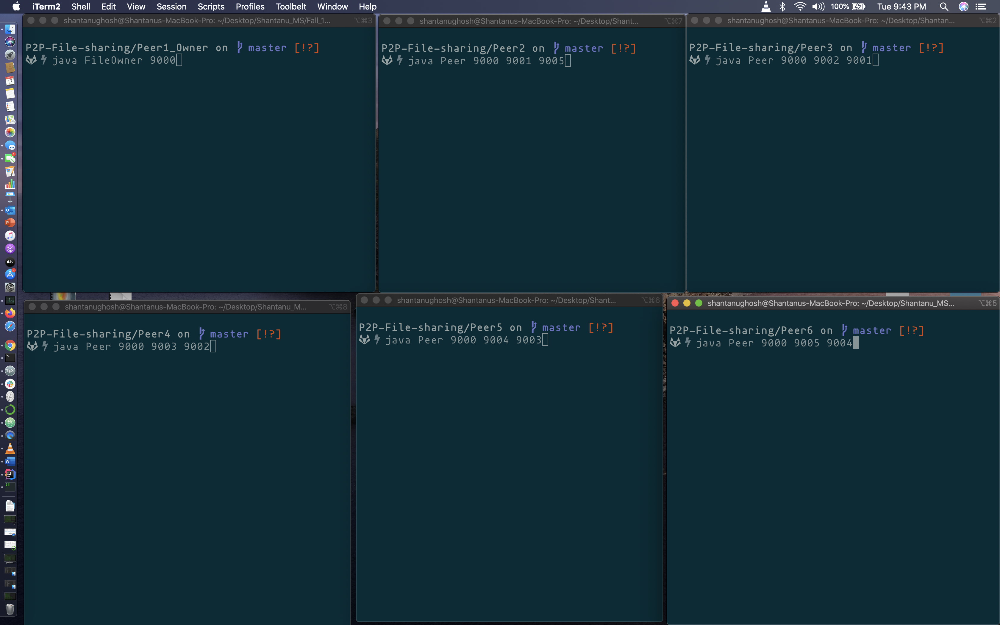

# Peer-to-Peer File Sharing Network

This repository hosts an implementation of a peer-to-peer network for file downloading. 
It resembles a simplified version of Bittorrent. 
There are two pieces of software – `peers` and `file owner`.

The file owner has a file, and it breaks the file into chunks of 100KB, each stored as a separate file. 
Note that the last chunk can be smaller than 100KB. 
The minimum number of chunks that the file can be split into is 5. The file owner listens on a TCP port. 
It should be designed as a **server** that can run multiple threads to serve multiple clients simultaneously.

Each peer should be able to connect to the file owner to download some chunks. 
It then should have **two threads of control**, 
one acting as a `server` that uploads the local chunks to another peer (referred to as upload neighbor), 
and the other acting as a `client` that downloads chunks from a third peer (referred to as download neighbor). 
So each peer has **two neighbors**, one of which will `get` the chunks from this peer and another one will `send` chunks
 to this peer.

Some features that are implemented as part of the project involves:
1. No always-on server
2. Arbitrary end systems can directly communicate
3. Peers request service from other peers, provide service in return to other peers
     - auto scalability – new peers bring new service capacity, as well as new service demands
4. Peers connect intermittently and can change its IP addresses, supporting complex management.

## Compilation
<b>File owner</b>  
cd Peer1_Owner  
javac FileOwner.java  

<b>Peer2</b>  
cd Peer2  
javac Peer.java  

<b>Peer3</b>  
cd Peer3  
javac Peer2.java  

<b>Peer4</b>  
cd Peer4  
javac Peer.java  

<b>Peer5</b>  
cd Peer5  
javac Peer5.java  

<b>Peer6</b>  
cd Peer6  
javac Peer6.java 
 
## Execution
1. Start the file owner process, giving a listening port.
2. Start five peer processes as:
<b>file owner, peer itself, download neighbor(another peer’s port) </b>
3. Each peer connects to the server’s listening port. The latter creates a new thread to upload one or several file chunks to the peer, while its main thread goes back to
listening for new peers.
4. After receiving chunk(s) from the file owner, the peer stores them as separate file(s)
and creates a summary file, listing the IDs of the chunks it has.
5. The peer then proceeds with two new threads, with one thread listening to its upload
neighbor to which it will upload file chunks, and the other thread connecting to its
download neighbor.
6. The peer requests for the chunk ID list from the download neighbor, compares with
its own to find the missing ones, and randomly requests a missing chunk from the neighbor. In the meantime, it sends its own chunk ID list to its upload neighbor, and upon request uploads chunks to the neighbor.
7. After a peer has all file chunks, it combines them for a single file.
8. A peer MUST output its activity to its console whenever it receives a chunk, sends a chunk, receives a chunk ID list, sends out a chunk ID list, requests for chunks, or
receives such a request.

# Post Completion:
After completion the file will be downloaded to each of the peer. 
Plus inside each Peer on Peer<id>Dir folder will be created where all the file chunks and a summary file which contains the chunk ids that the peer got from the owner will be present.
A detailed demo video can be found as <b>demo.mp4</b> file.

     

